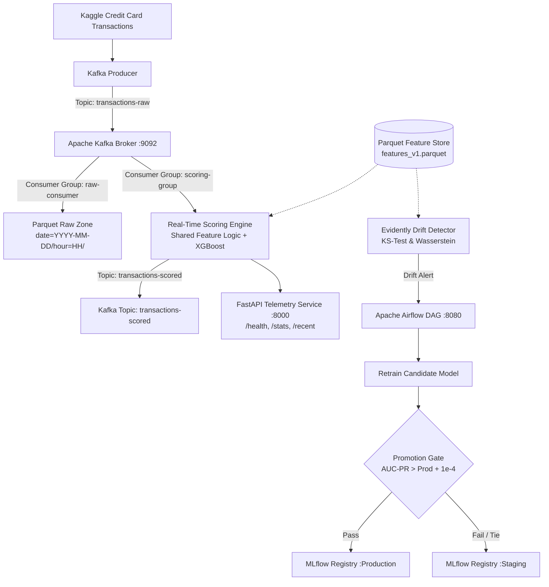

# FraudStream

Real-time credit card fraud detection system featuring Kafka event streaming, low-latency XGBoost scoring (<10ms), partitioned Parquet data lake ingestion, Evidently drift detection, and automated Airflow retraining with MLflow Model Registry promotion gating.

---

## Architecture Overview



---

## Operating Parameters & Performance

| Parameter / Metric | Value | Description |
|---|---|---|
| **Dataset Size** | 284,807 records | Kaggle Credit Card Fraud dataset (492 frauds, 0.172% prevalence) |
| **Hold-out Test Size** | 56,962 records | Chronological 20% hold-out split containing 75 fraud cases |
| **Model Champion** | XGBoost | Trained with `scale_pos_weight=577.88` on training split |
| **Test AUC-PR** | `0.7996` | Area Under the Precision-Recall Curve |
| **Test AUC-ROC** | `0.9782` | Area Under the Receiver Operating Characteristic Curve |
| **Decision Threshold** | `0.0310` | Calibrated against cost matrix ($122.21 FN cost vs. $10.00 FP friction) |
| **Test Recall @ 0.031** | `81.33%` | 61 of 75 fraudulent transactions caught |
| **Test Precision @ 0.031** | `56.48%` | 61 true positives, 47 false positives |
| **Expected Cost @ 0.031** | `$2,180.96` | 76.2% reduction in business losses vs default 0.50 threshold ($9,165.75) |
| **Scoring Latency (p50)** | `7.17 ms` | Kafka read + feature transform + XGBoost prediction |
| **Scoring Latency (p95)** | `8.21 ms` | Under continuous streaming load |
| **Promotion Delta ($\epsilon$)** | `1e-4` (0.0001) | Minimum AUC-PR improvement required to promote over active champion |
| **Key Drift Anchors** | `V17, V14, V12, V10, V16` | Top discriminating features monitored for distribution shifts |

---

## Prerequisites

- **Python**: 3.12+
- **Docker & Docker Compose** (for Kafka, Postgres, and Airflow)
- **Dataset**: `creditcard.csv` (~150MB) from [Kaggle Credit Card Fraud Detection](https://www.kaggle.com/datasets/mlg-ulb/creditcardfraud)

---

## Setup

### 1. Clone & Python Environment
```bash
git clone https://github.com/Bhagyesh-074/FraudStream.git
cd FraudStream
python -m venv venv
# Linux / macOS:
source venv/bin/activate
# Windows:
.\venv\Scripts\activate

pip install -r requirements.txt
```

### 2. Dataset Setup
Download `creditcard.csv` from Kaggle and place it inside the `data/` folder:
```
data/
  creditcard.csv
```
*(Verify integrity with `dvc status` or pull tracked artifacts via `dvc pull` if configured).*

### 3. Start Infrastructure
Start the Kafka broker, PostgreSQL metadata database, and Airflow orchestrator:
```bash
docker compose up -d
```
Verify running containers:
```bash
docker compose ps
```

---

## Running the Components

### 1. Train Baseline Model & Calibrate Threshold
Generates the versioned feature store (`data/feature_store/features_v1.parquet`), trains the XGBoost baseline, calibrates the cost-optimal threshold (0.031), logs the experiment run to MLflow (`sqlite:///mlflow.db`), and saves the champion model to `models/xgboost_baseline.json`:
```bash
python -m src.pipeline.train
```

### 2. Stream Transactions to Kafka
Replays transactions in chronological order to the `transactions-raw` topic:
```bash
# Stream continuously with 10ms delay between messages
python -m src.streaming.producer --delay 0.01

# Or replay a specific batch (e.g. 5,000 transactions)
python -m src.streaming.producer --limit 5000 --delay 0.005
```

### 3. Ingest Raw Transactions to Parquet Lake
In a separate terminal, run the raw consumer to partition incoming transactions into time-stamped Parquet files (`data/raw_zone/date=YYYY-MM-DD/hour=HH/`):
```bash
python -m src.streaming.raw_consumer --batch-size 500
```

### 4. Real-Time Scoring Consumer
In a separate terminal, consume from `transactions-raw`, calculate features, run inference using the champion model, and publish scored records with fraud probabilities to `transactions-scored`:
```bash
python -m src.serving.scoring_consumer
```

### 5. Observability & Telemetry API
Run the FastAPI service to monitor throughput, latency percentiles, and scored records:
```bash
uvicorn src.serving.api:app --host 0.0.0.0 --port 8000
```
*(Alternatively, run `python -m src.serving.api` to run both the scoring consumer and the FastAPI server in one process).*

#### Endpoints & Sample Responses
- **Health Check** (`GET /health`):
  ```bash
  curl http://localhost:8000/health
  ```
  ```json
  {
    "status": "healthy",
    "model_loaded": true,
    "threshold": 0.031,
    "model_source": "registry"
  }
  ```
- **Throughput & Latency Stats** (`GET /stats`):
  ```bash
  curl http://localhost:8000/stats
  ```
  ```json
  {
    "total_scored": 12500,
    "total_flagged": 21,
    "flag_rate": 0.00168,
    "latency_ms": {
      "mean": 7.34,
      "p50": 7.17,
      "p95": 8.21,
      "p99": 11.45,
      "min": 4.82,
      "max": 18.90
    },
    "uptime_seconds": 128.4
  }
  ```
- **Recent Scored Events** (`GET /recent?n=3`):
  ```bash
  curl http://localhost:8000/recent?n=3
  ```

### 6. Feature Drift Monitoring
Run Evidently drift detection between baseline training distributions and current transactions (evaluates KS-test, Wasserstein distance, and top-5 discriminatory features `V17, V14, V12, V10, V16`):
```bash
python -m src.monitoring.drift_detector
```
An interactive HTML drift report is generated at `reports/data_drift_report.html`.

### 7. Airflow Orchestration & Retraining DAG
Access the Airflow web interface at [http://localhost:8080](http://localhost:8080) (Username: `airflow`, Password: `airflow`).

To execute DAG runs directly via CLI:
- **Scheduled Drift Check (No Drift -> Retraining Skipped)**:
  ```bash
  docker compose exec airflow-webserver airflow dags test fraudstream_retrain_dag 2026-09-01
  ```
- **Drift-Triggered Retraining & Promotion Evaluation**:
  ```bash
  docker compose exec -e DRIFT_TRIGGER_TEST=1 airflow-webserver airflow dags test fraudstream_retrain_dag 2026-09-02
  ```
  *Note: A newly retrained candidate is only promoted to `Production` in the MLflow Model Registry if its AUC-PR exceeds the current production champion by more than 0.0001 (1e-4). Retraining runs on identical distributions or floating-point ties remain in `Staging`.*

---

## Test Suite

Run the full automated test suite (135 tests covering EDA, feature logic, streaming, scoring, model registry gating, and drift monitoring):
```bash
pytest tests/ -v
```

---

## Service Endpoints & Ports

| Service | Port | Description |
|---|---|---|
| **FastAPI Telemetry** | `8000` | Real-time health, statistics, and prediction ring buffer |
| **Apache Airflow Web UI** | `8080` | Pipeline orchestration UI (`airflow` / `airflow`) |
| **Apache Kafka** | `9092` | Event broker (`transactions-raw`, `transactions-scored`) |
| **PostgreSQL** | `5432` | Metadata store for Airflow |
| **MLflow Tracking** | Embedded | Local SQLite tracking store (`sqlite:///mlflow.db`) |

---

## Project Structure

```
FraudStream/
├── docker-compose.yml          # Kafka, Postgres, Airflow services
├── Dockerfile.airflow          # Custom Airflow image with ML dependencies
├── requirements.txt            # Python dependencies
├── models/
│   ├── xgboost_baseline.json   # Active champion XGBoost model
│   └── threshold_config.json   # Cost-calibrated threshold configuration
├── data/
│   ├── creditcard.csv          # Raw transaction data (gitignored / DVC tracked)
│   ├── feature_store/          # Versioned Parquet feature tables
│   └── raw_zone/               # Partitioned Parquet data lake
├── reports/
│   └── data_drift_report.html  # Evidently visual drift diagnostic report
├── src/
│   ├── eda/                    # Exploratory analysis, imbalance, and cost matrix
│   ├── pipeline/               # Training pipeline, evaluation, and registry gating
│   ├── features/               # Shared feature engineering & feature store
│   ├── streaming/              # Kafka replay producer and raw lake consumer
│   ├── serving/                # Real-time scoring consumer and FastAPI service
│   ├── monitoring/             # Unsupervised drift detection with Evidently
│   └── orchestration/          # Airflow retraining DAG definitions
└── tests/                      # 135 unit and integration tests
```

---

## License

MIT License.
